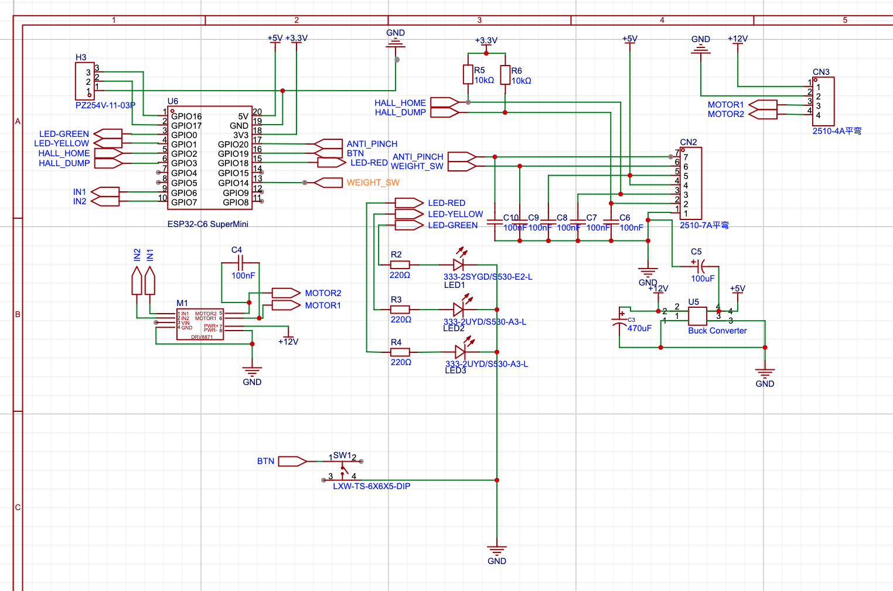
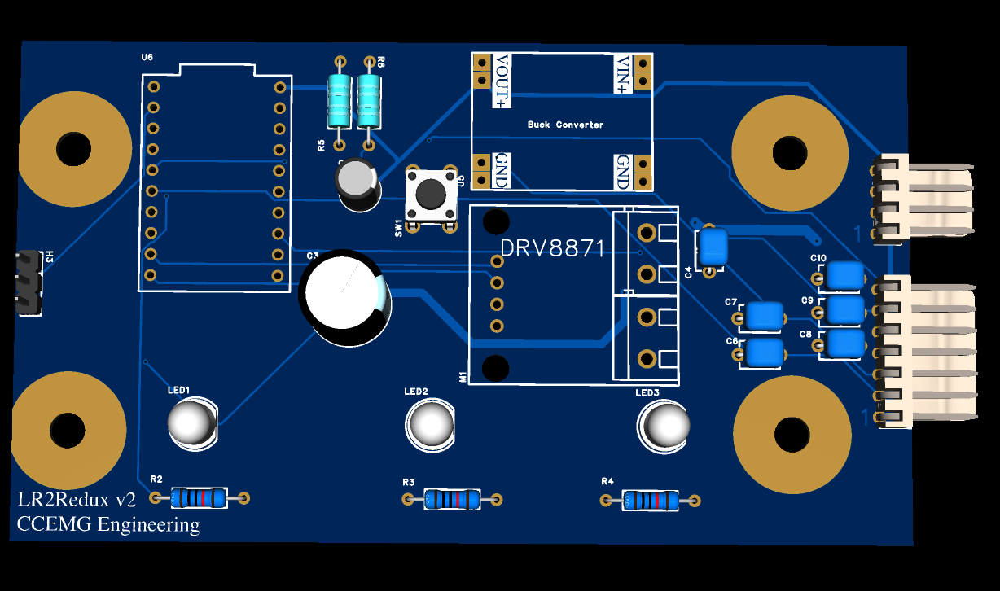

# LR2 Redux controller PCB (v2)

EasyEDA Pro design for the custom replacement control board, sized to mount
where the stock Litter Robot 2 board did.

| File | What it is |
|---|---|
| `LR2-controller.eprj` | EasyEDA Pro project (schematic + PCB). Open with EasyEDA Pro. |
| `Gerber_PCBv2_2026-09-19.zip` | Fabrication Gerbers for PCB v2 |
| `BOM_Boardv2_PCBv2_2026-09-19.xlsx` | Bill of materials |
| `PickAndPlace_PCBv2_2026-09-19.xlsx` | Component placement file for assembly |
| `screenshots/schematic-v2.png` | Schematic (ESP32-C6 SuperMini, DRV8871, buck converter, CN2 7-pin / CN3 4-pin stock connectors) |
| `screenshots/pcb-v2-3d-render.png` | 3D render of the board |

